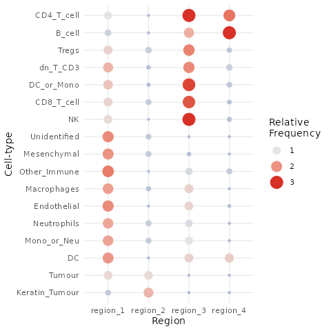
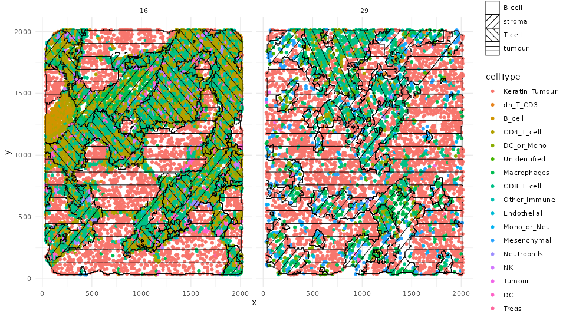
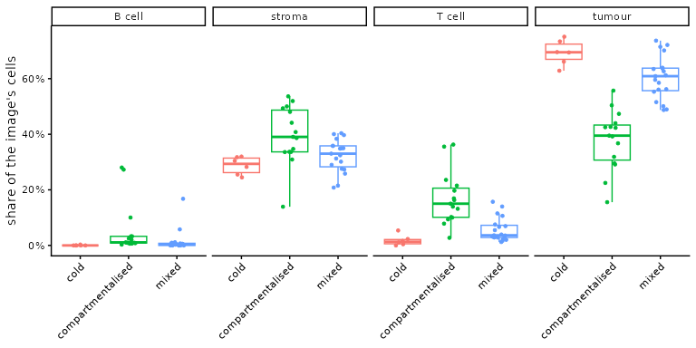
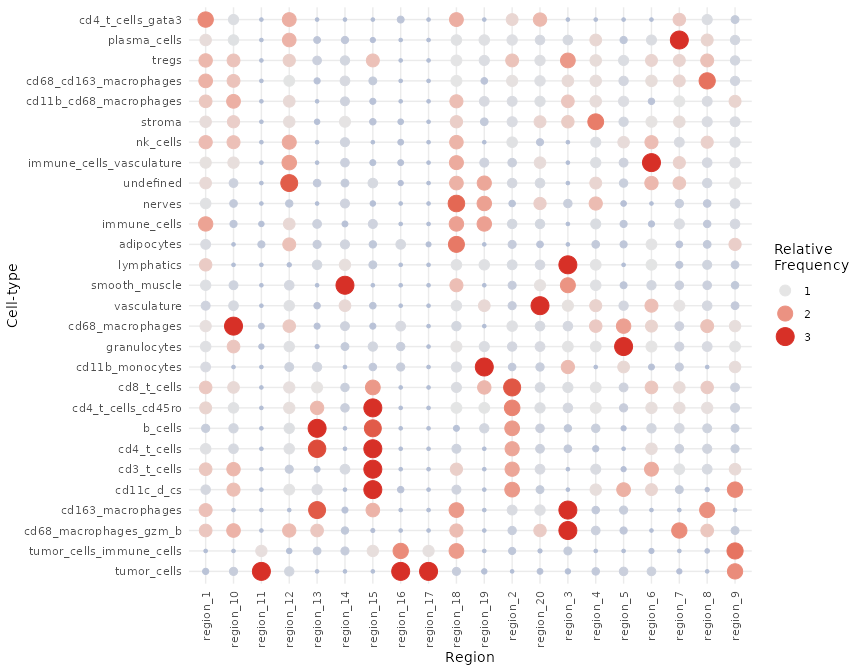
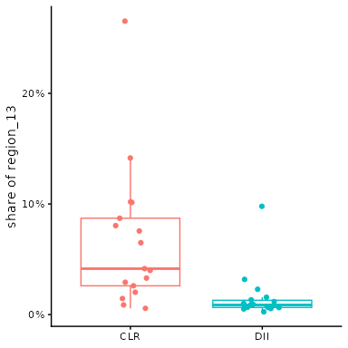

# Introduction to lisaClust

Abstract

Which parts of a tumour are tumour cells, which are immune infiltrate
and which are stroma? Which local neighbourhoods of cells are more
common in one group of patients than another? lisaClust describes, for
every cell, which cell types surround it, and groups cells with similar
surroundings into regions. With a few regions these are tissue domains;
with many they are cellular niches. This vignette finds domains in
triple-negative breast cancers and niches in colorectal cancers, and
compares them between groups of patients.

## Introduction

For each cell, lisaClust (Patrick et al. 2023) counts the cells of every
type within a few radii of it and compares each count with what would be
expected if that type were spread evenly over the image. These local
indicators of spatial association (LISA) describe the cell’s
surroundings: a tumour cell deep in a tumour nest has many tumour
neighbours and few immune neighbours, while a tumour cell at the
invasive margin has both. Clustering the cells by their LISA groups
cells with similar surroundings, whatever their own type, into
**regions**.

The number of regions sets the scale of the question. With a few
regions, they are broad tissue **domains**, such as tumour, stroma and
immune infiltrate. With 20 or more, they are cellular **niches**:
recurring local combinations of cell types, such as T cells mixed with
macrophages at a tumour border.

lisaClust needs only the type and position of every cell, so it applies
to any technology that gives segmented, typed cells: spatial proteomics
such as imaging mass cytometry, MIBI and CODEX, and spatial
transcriptomics such as Xenium, CosMx, MERSCOPE or high-definition
spatial transcriptomics (Patrick et al. 2023). It is not designed for
spot-based data such as Visium, where a spot holds several cells. It
works alongside other SydneyBioX packages: *spicyR* tests whether pairs
of cell types co-localise differently between groups of patients, and
*Statial* tests co-localisation within tissue compartments.

## Installation

``` r

if (!requireNamespace("BiocManager", quietly = TRUE)) install.packages("BiocManager")
BiocManager::install("lisaClust")
```

``` r

library(lisaClust)
library(SpatialExperiment)
library(SpatialDatasets)
library(ggplot2)
theme_set(theme_classic())
```

## Tissue domains in triple-negative breast cancer

### The data

Keren et al. (2018) imaged tumours from 40 patients with triple-negative
breast cancer by MIBI-TOF, one image per patient, and classified each
tumour by how its immune and tumour cells are arranged:
*compartmentalised*, where immune cells and tumour cells occupy separate
areas; *mixed*, where they are interspersed; and *cold*, with few immune
cells. The data are a `SpatialExperiment` in the SpatialDatasets
package, with the coordinates in pixels.

``` r

kerenSPE <- spe_Keren_2018()
patients <- unique(as.data.frame(colData(kerenSPE))[, c("imageID", "tumour_type")])
table(patients$tumour_type)
#> 
#>              cold compartmentalised             mixed 
#>                 6                15                19
sort(table(kerenSPE$cellType), decreasing = TRUE)
#> 
#> Keratin_Tumour    Macrophages     CD8_T_cell     CD4_T_cell         B_cell 
#>          99487          20616          15698          12438           9115 
#>    Mesenchymal   Other_Immune     DC_or_Mono       dn_T_CD3         Tumour 
#>           8170           6891           5049           3848           3167 
#>    Mono_or_Neu    Neutrophils    Endothelial   Unidentified          Tregs 
#>           3110           3018           2086           1725           1341 
#>             DC             NK 
#>           1245            674
```

### Finding domains

[`lisaClust()`](https://github.com/ellispatrick/lisaClust/reference/lisaClust.md)
computes the LISA of every cell and clusters them with k-means into `k`
regions, stored in a new `colData` column (`region` by default). It
looks for columns called `imageID` and `cellType`, and takes the
coordinates of a `SpatialExperiment` from
[`spatialCoords()`](https://rdrr.io/pkg/SpatialExperiment/man/SpatialExperiment-methods.html).
Here we ask for four domains, describing each cell’s surroundings within
20, 50 and 100 pixels.

``` r

set.seed(51773)
kerenSPE <- lisaClust(kerenSPE, k = 4, r = c(20, 50, 100))
table(kerenSPE$region)
#> 
#> region_1 region_2 region_3 region_4 
#>    67383   101637    21806     6852
```

k-means starts from random centres, so set a seed to make the regions
reproducible.

### What is in each domain?

[`regionMap()`](https://github.com/ellispatrick/lisaClust/reference/regionMap.md)
shows how much more often each cell type is found in each region than if
cell types were spread evenly over the regions: above one, the type is
enriched in that region.

``` r

regionMap(kerenSPE, type = "bubble")
```



The regions are numbered arbitrarily, so we name each one by the cell
type it is most enriched for, among tumour cells, CD8 T cells, B cells
and mesenchymal cells.

``` r

tab <- table(kerenSPE$cellType, kerenSPE$region)
enrichment <- tab / outer(rowSums(tab), colSums(tab)) * sum(tab)
markers <- c(tumour = "Keratin_Tumour", `T cell` = "CD8_T_cell", `B cell` = "B_cell", stroma = "Mesenchymal")
domainOf <- setNames(names(markers)[apply(enrichment[markers, ], 2, which.max)], colnames(enrichment))
domainOf
#> region_1 region_2 region_3 region_4 
#> "stroma" "tumour" "T cell" "B cell"
kerenSPE$domain <- domainOf[kerenSPE$region]
round(100 * prop.table(table(kerenSPE$domain)), 1)
#> 
#> B cell stroma T cell tumour 
#>    3.5   34.1   11.0   51.4
```

The cell types most enriched in each domain:

``` r

sapply(split(names(domainOf), domainOf), function(r) {
  e <- rowMeans(enrichment[, r, drop = FALSE])
  paste(names(sort(e, decreasing = TRUE))[1:4], collapse = ", ")
})
#>                                                 B cell 
#>                     "B_cell, CD4_T_cell, DC, dn_T_CD3" 
#>                                                 stroma 
#> "Other_Immune, Unidentified, Endothelial, Mesenchymal" 
#>                                                 T cell 
#>               "CD4_T_cell, NK, DC_or_Mono, CD8_T_cell" 
#>                                                 tumour 
#>           "Keratin_Tumour, Tumour, Tregs, Neutrophils"
```

### Domains in two tumours

[`hatchingPlot()`](https://github.com/ellispatrick/lisaClust/reference/hatchingPlot.md)
draws the cells coloured by type, with each region outlined and filled
with its own hatching, so types and regions can be seen together. Here
are the compartmentalised tumour and the mixed tumour with the most
cells in the T cell domain.

``` r

domainShare <- prop.table(table(kerenSPE$imageID, kerenSPE$domain), 1)
type <- patients$tumour_type[match(rownames(domainShare), patients$imageID)]
examples <- sapply(c("compartmentalised", "mixed"), function(t) {
  im <- rownames(domainShare)[type == t]
  im[which.max(domainShare[im, "T cell"])]
})
examples
#> compartmentalised             mixed 
#>              "16"              "29"
```

``` r

hatchingPlot(kerenSPE, useImages = examples, region = "domain", nbp = 200)
```



### Do the domains differ between kinds of tumour?

Each patient has one image, so the share of each domain in an image is a
value per patient.

``` r

shares <- data.frame(imageID = rep(rownames(domainShare), ncol(domainShare)),
                     domain = rep(colnames(domainShare), each = nrow(domainShare)),
                     share = as.vector(domainShare))
shares$tumour_type <- patients$tumour_type[match(shares$imageID, patients$imageID)]
ggplot(shares, aes(tumour_type, share, colour = tumour_type)) +
  geom_boxplot(outlier.shape = NA) +
  geom_jitter(width = 0.15, height = 0, size = 1) +
  facet_wrap(~ domain, nrow = 1) +
  scale_y_continuous(labels = function(v) paste0(100 * v, "%")) +
  labs(x = NULL, y = "share of the image's cells") +
  theme(legend.position = "none", axis.text.x = element_text(angle = 45, hjust = 1))
```



``` r

tcell <- domainShare[, "T cell"]
medians <- tapply(tcell, type, median)
round(100 * medians, 1)
#>              cold compartmentalised             mixed 
#>               1.3              15.0               3.6
pT <- wilcox.test(tcell[type == "compartmentalised"], tcell[type == "mixed"])$p.value
pT
#> [1] 9.138522e-05
```

The T cell domain makes up a median of 15% of the cells in a
compartmentalised tumour and 3.6% in a mixed one (Wilcoxon p = 9.1e-05).
In compartmentalised tumours the immune cells form their own areas,
which become a domain; in mixed tumours they sit among the tumour cells
and fall into the tumour domain.

Keren et al. (2018) classified the tumours from how their immune and
tumour cells are arranged, so this difference is a check that the
domains capture that arrangement, not an independent finding.

## Cellular niches in colorectal cancer

### The data

Schürch et al. (2020) imaged colorectal cancers from 35 patients by
CODEX, four tissue microarray cores per patient. The patients had one of
two patterns of immune response: a Crohn’s-like reaction (CLR, with
lymphoid follicles; 17 patients) or diffuse inflammatory infiltration
(DII; 18 patients). We leave out the objects the authors labelled as
debris (`dirt`).

``` r

schurchSPE <- spe_Schurch_2020()
schurchSPE <- schurchSPE[, schurchSPE$cellType != "dirt"]
schurchSPE$condition <- factor(ifelse(schurchSPE$group == 1, "CLR", "DII"))
table(unique(as.data.frame(colData(schurchSPE))[, c("patients", "condition")])$condition)
#> 
#> CLR DII 
#>  17  18
length(unique(schurchSPE$cellType))
#> [1] 28
```

### Finding niches

With 20 regions, the regions are finer combinations of cell types. We
store them in a column called `niche`.

``` r

set.seed(51773)
schurchSPE <- lisaClust(schurchSPE, k = 20, r = c(20, 50, 100), regionName = "niche")
```

``` r

regionMap(schurchSPE, region = "niche", type = "bubble") +
  theme(axis.text.x = element_text(angle = 90, vjust = 0.5, hjust = 1))
```



### Comparing niches between groups of patients

The question is whether a niche makes up more of the tissue in one group
of patients than in the other. The four cores of a patient come from the
same tumour, so they are not independent: we pool the cells of each
patient’s cores, so that each patient contributes one share of each
niche, and compare the two groups of patients. With 20 niches tested,
the p-values are adjusted for multiple testing.

``` r

cd <- as.data.frame(colData(schurchSPE))
byPatient <- prop.table(table(cd$patients, cd$niche), 1)
groupOf <- unique(cd[, c("patients", "condition")])
group <- groupOf$condition[match(rownames(byPatient), groupOf$patients)]

nicheTest <- function(share, group) {
  p <- apply(share, 2, function(v) wilcox.test(v[group == "CLR"], v[group == "DII"], exact = FALSE)$p.value)
  data.frame(niche = colnames(share),
             CLR = apply(share[group == "CLR", , drop = FALSE], 2, median),
             DII = apply(share[group == "DII", , drop = FALSE], 2, median),
             p_value = p, p_adj = p.adjust(p, "BH"))
}
patientTests <- nicheTest(byPatient, group)
head(patientTests[order(patientTests$p_value), ], 5)
#>               niche        CLR         DII      p_value       p_adj
#> region_13 region_13 0.04152047 0.008741548 0.0002652751 0.005305502
#> region_11 region_11 0.01593220 0.044091471 0.0071473256 0.071473256
#> region_5   region_5 0.02458821 0.042001232 0.0237693593 0.130436442
#> region_10 region_10 0.01383192 0.018377385 0.0360988449 0.130436442
#> region_15 region_15 0.01299103 0.008435928 0.0391172031 0.130436442
```

``` r

byCore <- prop.table(table(cd$imageID, cd$niche), 1)
coreGroup <- unique(cd[, c("imageID", "condition")])
coreTests <- nicheTest(byCore, coreGroup$condition[match(rownames(byCore), coreGroup$imageID)])
c(patients = sum(patientTests$p_adj < 0.05), cores = sum(coreTests$p_adj < 0.05))
#> patients    cores 
#>        1        4
```

With the 35 patients as the units, 1 niche differs between CLR and DII
patients at a 5% false discovery rate (smallest adjusted p-value
0.0053). Treating each of the 140 cores as an independent sample
instead, 4 niches differ.

Cores or images from the same patient are alike, so treating them as
independent overstates the evidence and turns up differences that the
patients do not support. Compare niches with patients as the units, and
adjust for the number of niches tested.

``` r

top <- patientTests$niche[which.min(patientTests$p_value)]
nicheTab <- table(cd$cellType, cd$niche)
nicheEnrichment <- nicheTab / outer(rowSums(nicheTab), colSums(nicheTab)) * sum(nicheTab)
round(sort(nicheEnrichment[, top], decreasing = TRUE)[1:5], 1)
#>                b_cells            cd4_t_cells      cd163_macrophages 
#>                   10.1                    2.8                    2.6 
#>     cd4_t_cells_cd45ro cd68_macrophages_gzm_b 
#>                    1.5                    1.4
```

The niche with the smallest p-value, region_13, is most enriched for
b_cells, cd4_t_cells, cd163_macrophages. It makes up a median of 4.2% of
the cells in CLR patients and 0.9% in DII patients, as expected for the
lymphoid follicles that define a Crohn’s-like reaction:

``` r

ggplot(data.frame(share = byPatient[, top], group = group), aes(group, share, colour = group)) +
  geom_boxplot(outlier.shape = NA) +
  geom_jitter(width = 0.15, height = 0, size = 1.5) +
  scale_y_continuous(labels = function(v) paste0(100 * v, "%")) +
  labs(x = NULL, y = paste("share of", top)) +
  theme(legend.position = "none")
```



## Using your own clustering

[`lisa()`](https://github.com/ellispatrick/lisaClust/reference/lisa.md)
returns the LISA themselves, one row per cell and one column per radius
and cell type, so you can cluster them any way you like.

``` r

curves <- lisa(kerenSPE[, kerenSPE$imageID %in% examples], r = c(20, 50, 100))
dim(curves)
#> [1] 13031    51
curves[1:3, 1:4]
#>        20_Keratin_Tumour 20_CD8_T_cell 20_dn_T_CD3 20_CD4_T_cell
#> cell_1         1.6233015    -0.8831332  -0.2041394    -0.8778542
#> cell_2        -0.7323238     4.0046288  -0.2041394    -0.8778542
#> cell_3        -0.7323238     3.9443524  -0.2041394    -0.8778542

# for example, k-means with several random starts
set.seed(51773)
km <- kmeans(curves, centers = 4, nstart = 10, iter.max = 50)
table(km$cluster)
#> 
#>    1    2    3    4 
#> 5555 1380 5934  162
```

## Choosing the settings

**The number of regions.** A few regions describe the large compartments
of a tissue; many regions separate finer neighbourhoods but split rarer
combinations across several regions and make each one harder to
interpret. Look at
[`regionMap()`](https://github.com/ellispatrick/lisaClust/reference/regionMap.md)
for a few values of `k` and choose the coarsest one that separates the
structures you care about; generic rules for the number of clusters,
such as the elbow or silhouette, can merge tissue structures that are
known to be distinct (Patrick et al. 2023).

**The radii.** Choose them from the scales of interaction you expect, in
the units of the coordinates: a radius of two or three cell diameters
describes the cell’s immediate neighbours, and larger radii describe its
wider surroundings. Several radii (`r`) are used together; run time
grows with the number and size of the radii, so a few well-chosen ones
are better than many.

**Uneven cell density.** By default the expected count assumes cells are
spread evenly over the image. With `sigma`, each neighbour is weighted
by the inverse of the local density of all cells, estimated with a
Gaussian kernel of bandwidth `sigma`, so that a dense area does not by
itself look enriched for every cell type.

## How it works

For cell *i*, cell type *j* and radius *r*, let *n_(ij)(r)* be the
number of cells of type *j* within *r* of cell *i*. If the cells of type
*j* were spread evenly over the image window *W*, with density
$`\lambda_j = N_j / |W|`$, the expected count would be

``` math
E_{ij}(r) = \lambda_j \, \pi r^2 e_i(r),
```

where $`e_i(r)`$ is the share of the disc of radius *r* around cell *i*
that lies inside the window, which corrects for cells near the edge. The
LISA is the standardised difference

``` math
\frac{n_{ij}(r) - E_{ij}(r)}{\sqrt{E_{ij}(r)}},
```

a local version of Ripley’s K function for the pair (`lisaFunc = "L"`
gives $`\sqrt{n_{ij}(r)} - \sqrt{E_{ij}(r)}`$ instead). The window is
the convex hull of the image’s cells by default (`window`). The
neighbour search and the edge correction run in C++, so the LISA of
hundreds of thousands of cells take seconds.

## Reporting results

A methods sentence might read: “We used lisaClust (version 1.21.1) to
compute, for each cell, local indicators of spatial association with
every cell type at radii of 20, 50 and 100 pixels, and clustered the
cells into 20 niches by k-means. The share of each niche in each patient
was compared between groups with a Wilcoxon test, with patients as the
units, and p-values were adjusted across niches by the
Benjamini–Hochberg method.” Show
[`regionMap()`](https://github.com/ellispatrick/lisaClust/reference/regionMap.md)
and a
[`hatchingPlot()`](https://github.com/ellispatrick/lisaClust/reference/hatchingPlot.md)
of example images with the results.

``` r

citation("lisaClust")
#> To cite package 'lisaClust' in publications use:
#> 
#>   Patrick E, Canete NP, Iyengar SS, Harman AN, Sutherland GT, Yang P
#>   (2023). "Spatial analysis for highly multiplexed imaging data to
#>   identify tissue microenvironments." _Cytometry Part A_, *103*,
#>   593-599. doi:10.1002/cyto.a.24729
#>   <https://doi.org/10.1002/cyto.a.24729>.
#> 
#> A BibTeX entry for LaTeX users is
#> 
#>   @Article{,
#>     title = {Spatial analysis for highly multiplexed imaging data to identify tissue microenvironments},
#>     author = {Ellis Patrick and Nicolas P. Canete and Sourish S. Iyengar and Andrew N. Harman and Greg T. Sutherland and Pengyi Yang},
#>     journal = {Cytometry Part A},
#>     volume = {103},
#>     pages = {593--599},
#>     year = {2023},
#>     doi = {10.1002/cyto.a.24729},
#>   }
```

## Session information

``` r

sessionInfo()
#> R version 4.6.1 (2026-06-24)
#> Platform: x86_64-pc-linux-gnu
#> Running under: Ubuntu 24.04.5 LTS
#> 
#> Matrix products: default
#> BLAS:   /usr/lib/x86_64-linux-gnu/openblas-pthread/libblas.so.3 
#> LAPACK: /usr/lib/x86_64-linux-gnu/openblas-pthread/libopenblasp-r0.3.26.so;  LAPACK version 3.12.0
#> 
#> locale:
#>  [1] LC_CTYPE=C.UTF-8       LC_NUMERIC=C           LC_TIME=C.UTF-8       
#>  [4] LC_COLLATE=C.UTF-8     LC_MONETARY=C.UTF-8    LC_MESSAGES=C.UTF-8   
#>  [7] LC_PAPER=C.UTF-8       LC_NAME=C              LC_ADDRESS=C          
#> [10] LC_TELEPHONE=C         LC_MEASUREMENT=C.UTF-8 LC_IDENTIFICATION=C   
#> 
#> time zone: UTC
#> tzcode source: system (glibc)
#> 
#> attached base packages:
#> [1] stats4    stats     graphics  grDevices utils     datasets  methods  
#> [8] base     
#> 
#> other attached packages:
#>  [1] ggplot2_4.0.3               SpatialDatasets_1.10.0     
#>  [3] ExperimentHub_3.2.2         AnnotationHub_4.2.2        
#>  [5] BiocFileCache_3.2.0         dbplyr_2.6.0               
#>  [7] SpatialExperiment_1.22.0    SingleCellExperiment_1.34.0
#>  [9] SummarizedExperiment_1.42.0 Biobase_2.72.0             
#> [11] GenomicRanges_1.64.0        Seqinfo_1.2.0              
#> [13] IRanges_2.46.0              S4Vectors_0.50.3           
#> [15] BiocGenerics_0.58.1         generics_0.1.4             
#> [17] MatrixGenerics_1.24.0       matrixStats_1.5.0          
#> [19] lisaClust_1.21.1            BiocStyle_2.40.0           
#> 
#> loaded via a namespace (and not attached):
#>  [1] DBI_1.3.0              deldir_2.0-4           httr2_1.3.0           
#>  [4] rlang_1.3.0            magrittr_2.0.5         otel_0.2.0            
#>  [7] compiler_4.6.1         RSQLite_3.53.3         spatstat.geom_3.8-3   
#> [10] png_0.1-9              systemfonts_1.3.2      vctrs_0.7.3           
#> [13] pkgconfig_2.0.3        crayon_1.5.3           fastmap_1.2.0         
#> [16] magick_2.9.1           XVector_0.52.0         labeling_0.4.3        
#> [19] rmarkdown_2.32         ragg_1.5.2             purrr_1.2.2           
#> [22] bit_4.6.0              xfun_0.61              cachem_1.1.0          
#> [25] jsonlite_2.0.0         goftest_1.2-3          blob_1.3.0            
#> [28] DelayedArray_0.38.2    spatstat.utils_3.2-5   BiocParallel_1.46.0   
#> [31] parallel_4.6.1         R6_2.6.1               bslib_0.12.0          
#> [34] RColorBrewer_1.1-3     spatstat.data_3.1-9    spatstat.univar_3.2-0 
#> [37] jquerylib_0.1.4        Rcpp_1.1.2             bookdown_0.48         
#> [40] knitr_1.52             tensor_1.5.1           Matrix_1.7-5          
#> [43] tidyselect_1.2.1       abind_1.4-8            yaml_2.3.12           
#> [46] codetools_0.2-20       spatstat.random_3.5-2  spatstat.explore_3.8-3
#> [49] curl_8.0.0             lattice_0.22-9         tibble_3.3.1          
#> [52] withr_3.0.3            KEGGREST_1.52.2        S7_0.2.2              
#> [55] evaluate_1.0.5         desc_1.4.3             polyclip_1.10-7       
#> [58] Biostrings_2.80.2      pillar_1.11.1          BiocManager_1.30.27   
#> [61] filelock_1.0.3         BiocVersion_3.23.1     scales_1.4.0          
#> [64] glue_1.8.1             pheatmap_1.0.13        tools_4.6.1           
#> [67] fs_2.1.0               grid_4.6.1             AnnotationDbi_1.74.0  
#> [70] nlme_3.1-169           cli_3.6.6              spatstat.sparse_3.2-0 
#> [73] rappdirs_0.3.4         textshaping_1.0.5      S4Arrays_1.12.1       
#> [76] dplyr_1.2.1            concaveman_1.2.0       V8_8.2.0              
#> [79] gtable_0.3.6           sass_0.4.10            digest_0.6.39         
#> [82] SparseArray_1.12.3     rjson_0.2.23           farver_2.1.2          
#> [85] memoise_2.0.1          htmltools_0.5.9        pkgdown_2.2.1         
#> [88] lifecycle_1.0.5        httr_1.4.9             bit64_4.8.6
```

## References

Keren, L, M Bosse, D Marquez, et al. 2018. “A Structured Tumor-Immune
Microenvironment in Triple Negative Breast Cancer Revealed by
Multiplexed Ion Beam Imaging.” *Cell* 174 (6): 1373–1387.e19.

Patrick, Ellis, Nicolas P Canete, Sourish S Iyengar, Andrew N Harman,
Greg T Sutherland, and Pengyi Yang. 2023. “Spatial Analysis for Highly
Multiplexed Imaging Data to Identify Tissue Microenvironments.”
*Cytometry Part A* 103: 593–99. <https://doi.org/10.1002/cyto.a.24729>.

Schürch, Christian M et al. 2020. “Coordinated Cellular Neighborhoods
Orchestrate Antitumoral Immunity at the Colorectal Cancer Invasive
Front.” *Cell* 182 (5): 1341–59.
<https://doi.org/10.1016/j.cell.2020.07.005>.
